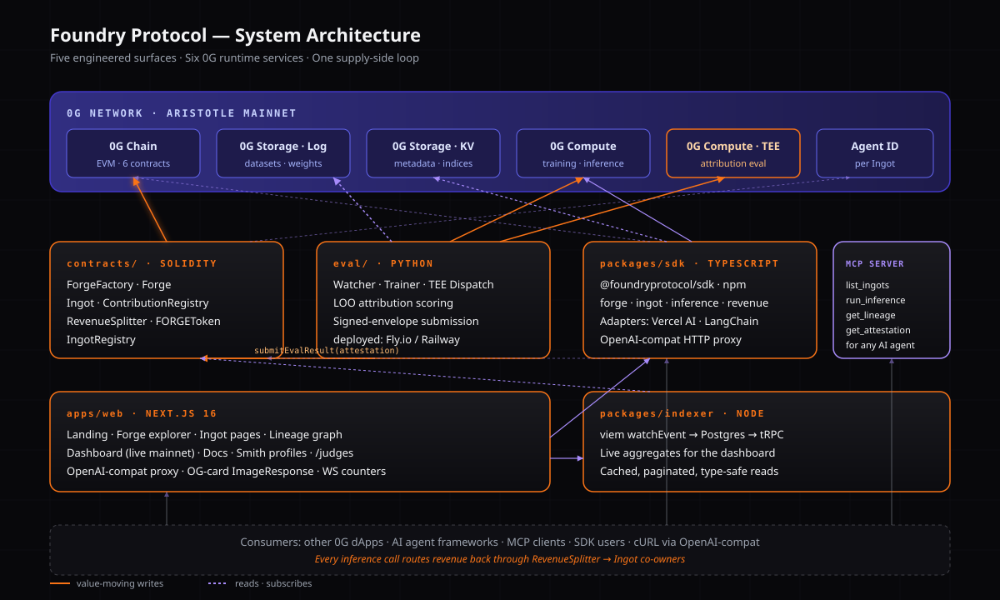

<div align="center">

  <!-- Foundry mark goes here once shipped -->
  <h1>FOUNDRY</h1>

**The supply-side protocol for 0G.**

Pool data, compute, and capital. Co-train an AI model. Own a verifiable, revenue-generating share — minted on mainnet, attributed inside a TEE.

[Website](https://foundryprotocol.xyz) · [Docs](https://foundryprotocol.xyz/docs) · [Build on Foundry](https://foundryprotocol.xyz/build-on-foundry) · [Dashboard](https://foundryprotocol.xyz/dashboard) · [X](https://x.com/foundryprotocol)

_0G APAC Hackathon 2026 · Grand Prize Build_

</div>

---

## What is Foundry?

Foundry is a protocol where anyone can pool data, compute, and capital to co-train AI models on 0G — and own a verifiable, revenue-generating share of the result.

Strangers form a **Forge**, a collective that pools datasets, compute credits, and capital. A verifiable attribution eval, executed inside a TEE on 0G Compute, measures **how much each contribution actually improved the model**. Ownership of the resulting **Ingot** — the trained model, registered with an Agent ID and stored on 0G — mints as $FORGE-denominated shares proportional to measured contribution. Every inference call against the Ingot routes revenue back to the co-owners automatically.

Other 0G submissions consume 0G. Foundry supplies it.

## Why this exists

- Individuals with valuable niche datasets have **no way to turn that data into an ongoing asset**.
- People with capital can't **co-invest in a model's creation** — there is no ownership instrument for "a share of a model."
- Compute providers sell at spot price and capture **none of the upside** of what they help create.

Foundry makes "a share of a model" a real, on-chain asset.

## The protocol in one diagram



```
        SMITHS                       THE FORGE                      CONSUMERS
       data → compute → capital      OPEN → EVAL (TEE) → MINTING       0G dApps
                                     → TRAINING → LIVE                 agents · MCP
                                                                       SDK users
                                              │
                                              ▼
                                          INGOT                  inference $ →
                                       (Agent ID +              RevenueSplitter
                                        weights on               → claim on-chain
                                        0G Storage)
```

Detailed architecture: [`docs/03-tech-architecture.md`](./docs/03-tech-architecture.md).

## What's in this repo

| Path                                                  | What                                                                                                                                      |
| ----------------------------------------------------- | ----------------------------------------------------------------------------------------------------------------------------------------- |
| [`docs/`](./docs)                                     | The build spec, the brand, the design system, the architecture, the sprint plan, the enhancements menu, the real-vs-roadmap honesty table |
| [`apps/web/`](./apps/web)                             | Next.js 16 — landing, app, dashboard, lineage graph, docs                                                                                 |
| [`packages/sdk/`](./packages/sdk)                     | `@foundryprotocol/sdk` — install via `pnpm add @foundryprotocol/sdk`                                                                      |
| [`packages/mcp-foundry/`](./packages/mcp-foundry)     | `@foundryprotocol/mcp` — MCP server, run via `npx @foundryprotocol/mcp` (Claude Desktop / Cursor / any MCP-capable agent)                 |
| [`packages/indexer/`](./packages/indexer)             | TypeScript indexer feeding the dashboard                                                                                                  |
| [`packages/design-tokens/`](./packages/design-tokens) | Color, type, motion, spacing tokens                                                                                                       |
| [`contracts/`](./contracts)                           | Solidity (Foundry toolkit). 6 contracts. 100% line coverage.                                                                              |
| [`eval/`](./eval)                                     | Python attribution coordinator. TEE-aware.                                                                                                |

## Documentation

The full docs are rendered at [foundryprotocol.xyz/docs](https://foundryprotocol.xyz/docs), but every doc is a real Markdown file in this repo — read them here:

- **[Build Spec v2](./docs/00-build-spec.md)** — the canonical spec.
- **[Brand](./docs/01-brand.md)** — positioning, voice, taglines.
- **[Design System](./docs/02-design-system.md)** — color, type, motion, components.
- **[Technical Architecture](./docs/03-tech-architecture.md)** — stack, package boundaries, contract architecture, threat model.
- **[Sprint Plan](./docs/04-sprint-plan.md)** — 5 sprints, 6 workstreams, dated milestones.
- **[Enhancements](./docs/05-enhancements.md)** — beyond-spec features prioritized for the grand prize.
- **[Real vs Roadmap](./docs/16-real-vs-roadmap.mdx)** — what's live on mainnet vs what's coming.
- **[Competitive Landscape](./docs/00-competitive-landscape.md)** — Foundry vs Bittensor, Ocean, Gensyn, Ora.
- **[Product Vision](./docs/VISION.md)** — Month 1 / 3 / 6 roadmap, revenue model, how each 0G integration deepens.

## Three-line quickstart

```ts
import { Foundry } from "@foundryprotocol/sdk";

const foundry = new Foundry({ contracts: "aristotle" });
const result = await foundry.inference.run("ingot:0x…", { input: "Hello" });
```

That's it. Your call is routed to the Ingot via 0G Compute. Revenue routes back to the Ingot's co-owners on-chain.

For agent-framework integration, see the [Vercel AI SDK adapter](https://foundryprotocol.xyz/docs/sdk-reference#vercel-ai), the [LangChain adapter](https://foundryprotocol.xyz/docs/sdk-reference#langchain), the [OpenAI-compatible proxy](https://foundryprotocol.xyz/docs/sdk-reference#openai-compat), or the [Foundry MCP server](./packages/mcp-foundry) (drop-in for Claude Desktop, Cursor, Cline, or any MCP-capable agent).

### MCP — for AI agents

```bash
npx @foundryprotocol/mcp
```

Exposes `list_ingots`, `run_inference`, `get_ingot`, `get_lineage`, and `get_attestation` as MCP tools. Drop into a Claude Desktop or Cursor config and any Ingot on Foundry becomes a first-class tool for your agent — with revenue automatically routing to the Ingot's co-owners on every call.

### OpenAI-compatible — zero-friction integration

Any tool that speaks OpenAI's API can call a Foundry Ingot:

```bash
curl https://foundryprotocol.xyz/api/v1/chat/completions \
  -H "content-type: application/json" \
  -H "x-foundry-ingot-id: 0x8e2…f4a" \
  -d '{"messages":[{"role":"user","content":"Translate to Konkani: …"}]}'
```

## Live mainnet status

| Contract               | Address (0G Aristotle, chain id 16661)                                                                                     |
| ---------------------- | -------------------------------------------------------------------------------------------------------------------------- |
| `FORGEToken`           | [`0xE716B0260f462b2A1789cB6cfCBd825736b920Ca`](https://chainscan.0g.ai/address/0xE716B0260f462b2A1789cB6cfCBd825736b920Ca) |
| `ContributionRegistry` | [`0x05235Ba0F2a77bcaB87371E4d797D6830ddC2d86`](https://chainscan.0g.ai/address/0x05235Ba0F2a77bcaB87371E4d797D6830ddC2d86) |
| `Ingot`                | [`0x39B736f424754d05a0da186d89015b74d1DDe1d3`](https://chainscan.0g.ai/address/0x39B736f424754d05a0da186d89015b74d1DDe1d3) |
| `RevenueSplitter`      | [`0xC58E0F32BD43e43153D3CA8ee8F25C8198789289`](https://chainscan.0g.ai/address/0xC58E0F32BD43e43153D3CA8ee8F25C8198789289) |
| `ForgeFactory`         | [`0x636109264EBF6cFD18CC38bD43eDf9cCad7ae23D`](https://chainscan.0g.ai/address/0x636109264EBF6cFD18CC38bD43eDf9cCad7ae23D) |
| `IngotRegistry`        | [`0xF8f3fAE648A8d7ee4Df0A7b10a0F759938aab7e1`](https://chainscan.0g.ai/address/0xF8f3fAE648A8d7ee4Df0A7b10a0F759938aab7e1) |

Live protocol counters (Forges, Ingots, contributions, revenue distributed) are rendered server-side from on-chain events on the [Forge in Public dashboard](https://foundryprotocol.xyz/dashboard).

**Judges**: wallet-less, pre-funded demo at [`/judges`](https://foundryprotocol.xyz/judges) — one-click inference against a live Ingot, no setup.

## License

[MIT](./LICENSE) — except `contracts/` (also MIT, but a separate copy for clarity if a future audit firm prefers Apache-2.0).

## Contributing

Foundry is an open protocol. If you're building on 0G and need a model — [build on Foundry](https://foundryprotocol.xyz/build-on-foundry). If you have a dataset or compute and want a share of what gets made — [join a Forge](https://foundryprotocol.xyz/forges). If you want to improve the protocol — open a PR.

---

_Built for the 0G APAC Hackathon 2026 — and beyond._
